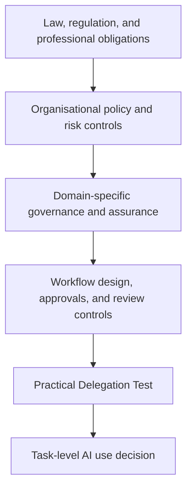
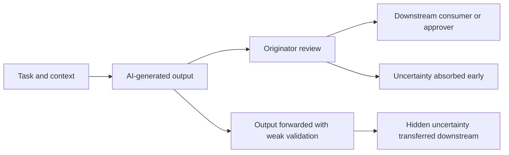
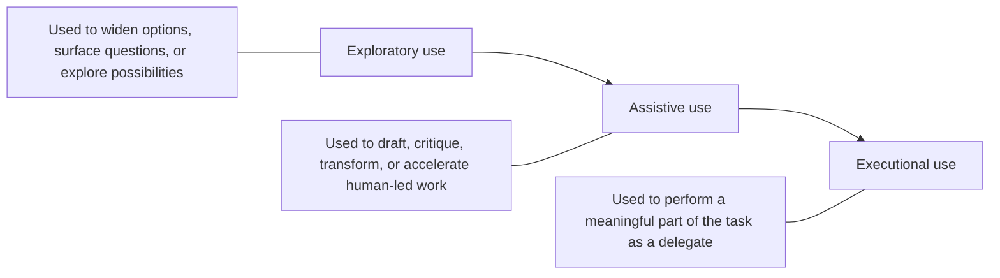
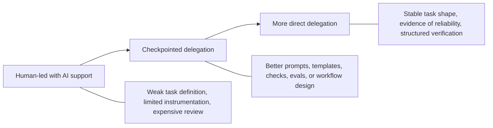

*The Practical Delegation Test for deciding where AI can execute, where humans should lead, and how accountability should be retained*

## Summary

This paper presents a practical framework for deciding what work to delegate to AI, what work should remain human-led, and what accountability remains after AI has contributed to the result. It is designed to improve day-to-day delegation decisions for both practitioners doing the work and leaders shaping the conditions around it by forcing attention onto outcome clarity, verification, retained human judgment, and the ownership of residual uncertainty. The paper also sets out delegation modes, accountability controls, multi-actor workflow considerations, organisational failure patterns, and worked examples that show how the framework can be applied in practice.

## 1. Purpose

AI has changed the constraint in knowledge work. In many current workflows, systems can generate plausible work faster than organisations can specify, review, absorb, and stand behind it.[^9] That creates a practical decision problem for both the people using the tools directly and the leaders accountable for how those tools change work. The question is no longer only whether a model can produce an output. The question is whether delegating the work produces a dependable result with less total human burden once clarification, review, integration, and accountability are counted properly.

The Practical Delegation Test is a practical operating heuristic for that problem. It helps teams decide where AI can execute usefully, where AI should be constrained behind checkpoints, where AI should remain a support tool rather than a delegate, and where the task should remain human-led.

This paper does not replace formal risk management, professional standards, legal review, or sector-specific controls. It offers a practical framework that can be used in ordinary working environments to improve delegation judgment before work is handed to a tool, a colleague, a reviewer, or a downstream operational process. This framing is consistent with the broader risk-management view that AI risk is socio-technical, lifecycle-spanning, and shaped by both technical properties and deployment context.[^1][^2]

## 2. The Practical Problem of AI Delegation

Many current narratives about AI adoption still frame the question too narrowly. They assume that if a system can generate useful output quickly, then time has been saved and productivity has improved. That framing is often incomplete because generation is only one stage in the full system of work.

Professional tasks usually involve at least five different forms of effort: defining the outcome, supplying sufficient context, generating a candidate result, verifying that result against the real need, and accepting responsibility for its consequences. AI frequently compresses only one of those stages. In some workflows that is enough to create a real gain. In others it simply shifts the remaining burden elsewhere.

That distinction matters because AI often improves local speed while degrading system performance. A large code change may be fast to generate but expensive to review. A plausible draft response may be fast to produce but still carry legal, reputational, or interpersonal risk that must be absorbed by a human. A summary may look complete while hiding omissions that become someone else's problem later. The practical failure in those cases is not that the model generated something. The failure is that the delegation decision was made on a narrower cost model than the real work required. This interpretation is consistent with long-standing human-automation research showing that automation can reduce some forms of workload while creating new monitoring, verification, and handoff problems, and with more recent generative-AI work that describes a shift from production toward evaluation and workflow restructuring.[^3][^4][^9]

In this paper, productivity is treated less as time-to-output and more as the quality of outcome achieved per unit of total workflow burden. The main emphasis is human attention, because that is where many organisations are currently undercounting cost. Where model cost, latency, tool-call spend, or infrastructure overhead are material, those should be counted explicitly as well. This is a practical operating lens for environments where generation is cheap relative to review, and where accountability remains human even when execution is partly machine-assisted.[^9]

## 3. Scope and Limits

The Practical Delegation Test is a first-order delegation heuristic. It is designed to improve task allocation, review design, and accountability discipline in everyday work. It is not sufficient on its own for high-assurance or tightly regulated domains, and it should not be read as one.[^1][^2]

The framework is most useful in settings such as:

- drafting, analysis, coding, communication, planning, or operational support work where AI is already being considered or used;
- teams that need a practical language for discussing how far delegation should go;
- workflows where the main risk is hidden review debt, poor task selection, or ambiguous accountability rather than immediate catastrophic harm.

The framework is not intended to replace:

- statutory or regulatory obligations;
- sector-specific safety or assurance controls;
- professional standards of care;
- formal model governance, procurement, or security review;
- legal advice;
- or domain-specific risk assessment methods.

In higher-risk settings, the test should sit inside a wider control stack rather than outside it.

The framework is also intended mainly for bounded task handoffs or clearly identified workflow steps. It is less useful when applied mechanically to every micro-decision, such as accepting an inline autocomplete suggestion, because the deliberation cost would exceed the value of the check. In those cases the more relevant question is whether the wider workflow has already been designed with sensible defaults, review expectations, and guardrails.

The same boundary matters for agentic or multi-step workflows. Where one AI system is orchestrating tools, calling other models, or decomposing work into sub-tasks, the framework should be applied at the workflow or sub-workflow boundary rather than only at the final visible output. In those settings, uncertainty can compound across steps, and apparently cheap final review may hide a more complex chain of delegated decisions.

The practical implication is simple. If the wider control environment says a task requires formal sign-off, traceability, separation of duties, human review, or explicit evidence retention, this heuristic does not override those requirements. It helps structure the task-level judgment inside them.

## 4. The Practical Delegation Test

The framework consists of four questions:

1. Can I describe the outcome clearly?
2. Can I verify the result cheaply enough?
3. What judgment must remain human?
4. Where does the uncertainty go?

Taken together, those questions support three decisions:

- whether the task is appropriate for AI delegation at all;
- what level of delegation is appropriate;
- and what human accountability remains after AI has contributed.

The framework is intentionally qualitative. It uses structured questions and recognizable answer patterns, but it avoids false precision, single-number outputs, and the impression that a tidy score can remove the need for judgment. Its purpose is to force the right discussion before low-cost generation produces high-cost ambiguity.

The four questions are not statistically independent. In practice they often covary, especially in contested or consequential work. They still earn separate treatment because teams usually disagree for different reasons. One disagreement may be about whether the outcome is really clear, another about whether subtle failures are detectable, and another about where legitimate judgment still sits. Keeping the questions separate makes those disagreements easier to surface and challenge.

## 5. Defining the Four Questions

### 5.1 Outcome Clarity

The first question is whether the intended outcome is defined clearly enough for delegation to be meaningful. This is not the same as having a vague aspiration such as "write something good" or "look into this." It means the delegating human can describe the task in a way that makes success, failure, constraints, audience, and exclusions intelligible.

Outcome clarity is usually higher when the person delegating can answer questions such as:

- What is the output for?
- Who is it for?
- What would make it acceptable?
- What would make it unusable?
- What constraints, policies, factual boundaries, or formats apply?

Outcome clarity is usually lower when the task is still being discovered, when the quality bar exists mainly in tacit knowledge, or when the delegating human is relying on the AI to decide what the work really is.

Poor clarity does not always mean AI should not be used. It often means the task belongs in exploratory rather than executional use.

### 5.2 Verification Cost

The second question is whether the result can be verified cheaply enough for delegation to remain worthwhile. This is the most commonly undercounted part of the decision.

In this paper, cheap verification does not mean trivial verification or automated verification only. It means that the checking burden is proportionate to the value of the task and realistic within the actual workflow. A task can still be worth delegating even if review is non-trivial, but only if that review cost is an explicit part of the decision rather than hidden overhead. Where the workflow also carries material model cost, latency, or execution overhead, those should be counted alongside the human review cost rather than after it. That emphasis is consistent with research showing that verification complexity is an important mediator of automation bias and that plausible automated assistance can still create decision risk when meaningful checking is hard.[^5][^6]

Verification cost has at least five dimensions:

| Dimension | Practical question |
| --- | --- |
| Time | How long does meaningful checking take? |
| Expertise | Who is qualified to detect the important failures? |
| Detectability | Are likely errors visible or plausibly hidden? |
| Reversibility | If review misses something, how easy is it to correct later? |
| Check structure | Is there an objective, repeatable, or instrumented way to test the result? |

Verification is usually cheaper when the output can be tested, reconciled, compared against known-good examples, validated against a checklist, or inspected against explicit criteria. It is usually more expensive when the output is persuasive but hard to test, when errors are subtle, when tacit context dominates, or when the only real check is live consequence.

The important distinction is not whether review exists. Most serious work requires review. The distinction is whether the review burden is controlled, visible, and proportionate, or whether it swamps the notional time saved at generation time.

### 5.3 Retained Human Judgment

The third question is what judgment must remain human. This is the point where many superficially capable demonstrations stop being useful decision tools.

AI can execute, draft, compare, classify, transform, and generate options. It does not follow that AI should decide what the organisation believes, what risk is acceptable, what trade-off is legitimate, what promise can be made, what priority is justified, or what outcome is ethically defensible.

For the purposes of this paper, five related terms need to be kept separate:

| Term | Meaning in practice |
| --- | --- |
| Judgment | The human evaluation of what matters, what is acceptable, and which trade-off should prevail |
| Responsibility | The obligation to perform a role or part of a workflow |
| Accountability | The obligation to answer for the outcome and stand behind it organisationally |
| Authority | The permission to decide or approve |
| Liability | The legal or formal exposure attached to the outcome |

One person may hold all five, but often they do not. A subject matter expert may exercise judgment without final accountability. A manager may be accountable without doing the detailed work. A regulated process may impose liability even where authority is delegated.

The question in the Practical Delegation Test is therefore not whether humans remain "in the loop" in a vague sense. It is what part of the real judgment load must remain explicitly human if the work is still to be accepted legitimately. This is close to the distinction made in trust-in-automation research between nominal human presence and appropriate human reliance, oversight, and intervention authority.[^7][^8]

A workflow may leave judgment with one person, authority with another, accountability with a manager, and liability with the organisation. Keeping those distinctions visible is essential to sound delegation.

### 5.4 Uncertainty Ownership

The fourth question is where the residual uncertainty goes after AI has produced an output. This is often the least examined part of an AI workflow and one of the most operationally important.

If the originating user has not absorbed the checking burden and still passes the result onward, the work has not disappeared. The uncertainty has simply moved. That may mean a reviewer receives a pull request whose apparent completeness masks weak edge-case reasoning, a manager receives an analysis that still contains untested assumptions, or a customer receives a message whose tone is polished but whose factual basis is fragile.

Not all downstream review is a failure. Legitimate review is part of many healthy systems. The problem is hidden burden-shifting rather than review itself.

| Legitimate review allocation | Hidden uncertainty transfer |
| --- | --- |
| Review is expected, scoped, and resourced | Review is implicit, improvised, or dumped on the recipient |
| The originator has done the checks expected at their stage | The originator forwards work mainly because it looks plausible |
| Residual uncertainty is visible and named | Residual uncertainty is obscured by polish or confidence |
| The reviewer has authority, time, and context to challenge it | The reviewer is socially or operationally pressured to accept it |

This question is especially important in organisations where apparent throughput is rewarded more visibly than clean handoffs. In those environments, AI can easily become a machine for manufacturing downstream ambiguity under the appearance of productivity. The concern is not new. It echoes the long-standing automation problem in which humans are left with residual monitoring and exception-handling burdens after the apparently easier parts of the work have been delegated away.[^3][^4]

## 6. Delegation Modes

AI is not used in only one way, and the framework becomes easier to apply once three broad modes are separated. These modes are a practical simplification informed by the wider literature on types and levels of human interaction with automation.[^7]

These modes are not the same thing as the delegation levels introduced in Section 7. Modes describe the kind of use. Levels describe the degree of delegated authority and review burden. In practice, exploratory use usually maps to human-led work with AI support, assistive use may range from human-led to checkpointed delegation, and executional use may range from checkpointed to direct delegation depending on verification and retained judgment.

| Mode | Typical delegation level range |
| --- | --- |
| Exploratory use | Usually human-led with AI support |
| Assistive use | Usually human-led with AI support or checkpointed delegation |
| Executional use | Usually checkpointed delegation or direct delegation |

### Exploratory Use

Exploratory use is appropriate when the task itself is still being discovered. In that mode, outcome clarity may be low by definition, but the objective is not direct execution. The value comes from widening option discovery, reframing the problem, or accelerating sense-making. The human remains clearly in charge.

### Assistive Use

Assistive use applies where the task is real and bounded, but the human remains visibly central. AI may draft, summarise, critique, restructure, or propose options. This mode is often appropriate where verification is meaningful but still manageable and where core judgment remains human.

### Executional Use

Executional use applies where AI performs a substantive part of the task as a delegate rather than merely as an assistant. This demands materially higher outcome clarity, a credible verification path, and clean accountability.

One of the most common category errors in AI adoption is to take a workflow that is only safe as exploratory or assistive use and treat it as though it were already suitable for executional delegation.

## 7. Interpreting Results and Choosing Delegation Levels

The four questions do not produce a score. They produce a pattern. In practice, that pattern usually leads to one of four delegation levels.

| Delegation level | When it is usually appropriate | What the human still has to do |
| --- | --- | --- |
| Direct delegation | Outcome is clear, verification is structured, consequences are low or reversible, and retained judgment is limited | Specify the task, check the result, and accept the outcome |
| Checkpointed delegation | AI can execute substantial work, but important transitions or assumptions still require review | Approve checkpoints, test assumptions, and decide what survives |
| Human-led with AI support | The task contains significant ambiguity, important judgment, or costly verification | Use AI as support, but keep the human in visible control of substance and acceptance |
| Do not delegate | The task is too unclear, too sensitive, too hard to verify, or too likely to externalise uncertainty | Redesign the workflow, clarify the task, or handle it directly |

These are not rules to apply mechanically. They are common patterns worth checking your own reasoning against.

A useful shorthand is to treat weak answers in different ways.

- If outcome clarity is weak, move left toward exploratory or assistive use.
- If verification cost is high, reduce the level of delegation or redesign the workflow.
- If retained judgment is high, keep decision authority visibly human.
- If uncertainty is likely to land on someone else, stop and redesign the handoff.

The aim is not maximum delegation. The aim is appropriate delegation.

## 8. Accountability in Practice

Accountability only becomes meaningful if it shows up in actual controls, decisions, and evidence. That is also aligned with current AI risk-management frameworks, which treat governance, measurement, and management as operational responsibilities rather than abstract principles alone.[^1][^2]

### 8.1 Practical Accountability Controls

Depending on the task, accountability after AI delegation may require some combination of the following:

- explicit approval before release, submission, or execution;
- named ownership of the result;
- retention of prompts, source context, or decision rationale where proportionate;
- evidence of what was verified and by whom;
- assignment of reviewers with enough context and authority to challenge the output;
- traceability of material changes or decisions;
- confirmation that policy, security, legal, or compliance checks were performed where required.

The right control set is context-dependent. The important point is that accountability should be expressed through operational behaviour, not left as a moral slogan attached to the end of the workflow.

Where roles are separated, it is often useful to state the position explicitly. For example, a developer may hold immediate responsibility for producing the work, a reviewer may exercise part of the judgment needed to challenge it, a team lead may hold authority to approve release, a manager may carry accountability for the workflow outcome, and liability may still sit with the organisation.

### 8.2 Multi-Actor Workflows

Many real workflows do not have one coherent task owner. They involve several roles:

- originator, who initiates the task;
- executor, which may be the AI-enabled worker or team member using the tool;
- reviewer, who checks quality or conformance;
- approver, who authorises release or decision;
- accountable owner, who carries organisational responsibility for the outcome.

These roles sometimes sit in one person, but often they do not. The framework should therefore be applied with role separation in mind. A workflow is not well-governed merely because someone, somewhere, is notionally accountable. The question is whether each role understands what it is expected to validate, what uncertainty remains, and whether it has the authority to stop poor work from progressing.

### 8.3 Review Power Matters

Accountability degrades when reviewers do not have safe refusal power. A nominal human review step is weak if the reviewer lacks time, context, status, or political cover to challenge the output. In that situation, the same uncertainty-transfer problem described earlier can survive behind the appearance of a human checkpoint.

This is why the framework cannot be applied purely as an individual judgment tool. In some settings the main failure is not poor prompting or poor task selection. It is that the surrounding system rewards throughput, masks uncertainty, and makes challenge socially expensive.

## 9. Organisational Conditions and Failure Patterns

The quality of an AI delegation decision depends partly on the surrounding organisation.

### 9.1 Incentives and Metric Distortion

The framework works poorly when teams are rewarded only for visible speed, output volume, or short-term turnaround. Under those conditions, it becomes rational for people to generate more than the system can responsibly absorb. Review burden, rework, incident risk, and trust degradation then appear later in the workflow rather than in the local metric that drove the behaviour. This is one reason AI risk is often better understood as socio-technical rather than purely technical, and why workflow design can matter as much as model capability.[^1][^3][^9]

Teams that want the framework to work in practice usually need at least some attention to:

- downstream review effort;
- rework created by weak AI-generated outputs;
- incident or defect rates;
- trust in internal handoffs;
- and whether AI use is actually reducing attention load rather than redistributing it.

The same task can also change character depending on who receives the output. Internal-only AI support may tolerate more ambiguity, more correction, and more iterative clarification than customer-facing or externally consequential output. A workflow that is acceptable as internal triage support may be unacceptable as direct customer communication, public statement, or operational decision. The framework is therefore not only about task type. It is also about where the output lands and who bears the cost if it is wrong.

### 9.2 Performative Compliance

Any useful governance language can be gamed. A team can claim that verification was cheap enough, that a human remained accountable, or that uncertainty was owned, while still using the framework as cover for low-discipline delegation. This is not a flaw unique to this model, but it is a real operational risk.

The main defence is not more abstract principle. It is visible workflow evidence. If no one can say what was checked, who checked it, what remained uncertain, and who had authority to reject it, then the framework has probably been adopted in language more than in practice.

### 9.3 Legal, Regulatory, and Assurance Boundaries

In regulated or higher-risk settings, accountability may require formal documentation, auditability, separation of duties, explainability expectations, or sector-specific evidence retention. The Practical Delegation Test should be treated as upstream support for those obligations, not a substitute for them.

## 10. Maturity Over Time

Delegation decisions should not be treated as permanent properties of a task. Many workflows become safer to delegate as controls mature. That is consistent with lifecycle-oriented risk management, which treats governance, measurement, and management as ongoing rather than one-off design activities.[^1][^2]

The same task may move across delegation levels over time because:

- prompts or instruction sets improve;
- reusable templates or examples reduce ambiguity;
- evaluation or testing becomes more systematic;
- better instrumentation makes failures easier to detect;
- the team learns where the real judgment boundary sits;
- or the workflow is redesigned so that uncertainty is absorbed earlier.

This maturity point matters for two reasons. First, it prevents the framework from becoming static or anti-adoption. Second, it makes clear that some tasks are not unsuitable for delegation in principle. They are unsuitable now because the current workflow cannot absorb them responsibly.

The same logic can run in reverse. Delegation can become less safe over time if model behaviour changes, if vigilance degrades into rubber-stamping, if prompts drift, if a tool begins to be used in a different context, or if several individually reasonable AI-assisted steps are chained together into a more fragile multi-step workflow. Maturity therefore has to include monitoring for regression, not only optimism about improvement.

## 11. Worked Examples

The examples below are intended to show the framework under both comfortable and uncomfortable conditions. Some are easy cases. Others are deliberately borderline.

### Example 1: Meeting Summary from a Recorded Internal Call

**Task:** Produce a concise summary of a one-hour internal project meeting, including decisions, actions, and unresolved questions.

**Outcome clarity:** High. The expected output is short, structured, and intended for a known audience.

**Verification cost:** Moderate but manageable. The organiser can compare the draft against the transcript or recording and correct missing actions or misattributed decisions without disproportionate effort.

**Retained human judgment:** Moderate. The organiser still decides what counts as a decision, whether any wording creates political risk, and whether sensitive matters should be omitted or reframed.

**Uncertainty ownership:** Good if the organiser reviews before circulation. Poor if the draft is simply forwarded because it appears tidy.

**Delegation decision:** Checkpointed delegation.

**Human accountability:** The organiser remains accountable for accuracy, completeness, distribution, and tone.

### Example 2: Unit Tests for a Narrowly Scoped Transformation Function

**Task:** Draft unit tests for a small function that normalises postcode formatting.

**Outcome clarity:** High. Expected inputs, outputs, and edge cases are relatively specific.

**Verification cost:** Low. The tests can be run directly and inspected for relevance.

**Retained human judgment:** Limited but real. The developer still decides whether the test set covers the behaviour that matters and whether key edge cases are missing.

**Uncertainty ownership:** Good if the developer checks before committing. Poor if reviewers are left to discover that the tests are shallow or misleading.

**Delegation decision:** Direct delegation with quick human review.

**Human accountability:** The developer remains accountable for test quality and coverage.

### Example 3: First Draft of a Customer Complaint Response

**Task:** Draft a response to a customer complaint about missed appointments and poor communication.

**Outcome clarity:** Partial. The format and tone can be described, but the substance depends on facts, policy, and the relational context of the complaint.

**Verification cost:** Material. The manager still needs to check factual claims, promises made, policy alignment, and whether the wording escalates or calms the situation.

**Retained human judgment:** High. The human must decide what should be admitted, what remedy is appropriate, and what commitments can legitimately be made.

**Uncertainty ownership:** Poor if the message is sent without careful review, because the risk falls on the customer and the organisation.

**Delegation decision:** Human-led with AI support.

**Human accountability:** The manager remains accountable for facts, promises, tone, and the final decision to send.

### Example 4: Product Requirements Draft for a New Internal AI Feature

**Task:** Produce a first draft of requirements for an internal AI-assisted search feature, including use cases, non-functional constraints, and likely success measures.

**Outcome clarity:** Mixed. The document structure can be specified, but some of the most important product questions are still contested.

**Verification cost:** Moderate to high. It is possible to review the draft for coherence, but harder to verify whether it reflects the right user need, constraint set, and strategic trade-offs.

**Retained human judgment:** High. The product owner or lead still has to decide what the feature is for, which trade-offs matter, what counts as acceptable risk, and what not to build.

**Uncertainty ownership:** Often poor if the draft is circulated as if it were decision-ready, because downstream stakeholders then have to unpick hidden assumptions.

**Delegation decision:** Checkpointed delegation at most, and often better treated as human-led with AI support.

**Human accountability:** The product lead remains accountable for the problem framing, prioritisation logic, and decision quality.

### Example 5: Support Incident Triage Summary

**Task:** Summarise a cluster of support tickets and propose likely root-cause themes for engineering triage.

**Outcome clarity:** Moderate. The format is clear, but the task sits between summarisation and interpretation.

**Verification cost:** Moderate. Reviewers can inspect whether the tickets were classified sensibly, but confirming root cause may require deeper operational knowledge.

**Retained human judgment:** Moderate to high. The engineering or operations lead still decides whether the proposed themes represent true patterns, coincidence, or noise.

**Uncertainty ownership:** Good if the summary is clearly labelled as triage support and followed by engineering validation. Poor if it is treated as diagnosis.

**Delegation decision:** Checkpointed delegation.

**Human accountability:** The lead remains accountable for whether the triage outcome is used only as prioritisation support or mistakenly treated as established fact.

### Example 6: Ranking Employees for Redundancy

**Task:** Use AI to propose a ranked list of employees for redundancy.

**Outcome clarity:** The mechanical output can be described, but the substantive legitimacy problem is much larger than the formatting problem.

**Verification cost:** Prohibitively high in any meaningful sense. The consequences are severe, the assumptions are contestable, and fairness, legal exposure, and organisational legitimacy dominate the decision.

**Retained human judgment:** Very high. The decision is irreducibly human and should not be displaced behind apparent computational objectivity.

**Uncertainty ownership:** Any hidden uncertainty lands directly on affected employees and on the organisation's own legal and ethical exposure.

**Delegation decision:** Do not delegate the decision. AI may support administrative preparation, policy retrieval, or scenario modelling, but not the selection decision itself.

**Human accountability:** Human decision-makers remain fully accountable for process and outcome.

### Example 7: Drafting an Internal Data-Quality Monitoring Proposal

**Task:** Draft a proposal for a new data-quality monitoring workflow across several source systems.

**Outcome clarity:** Moderate. The desired document type is clear, but the important design trade-offs may still be emerging.

**Verification cost:** Moderate to high. The document can be checked for coherence, but judging whether it is operationally realistic requires system knowledge, ownership clarity, and delivery experience.

**Retained human judgment:** High. The author still has to decide what to monitor, how escalation should work, what service level is realistic, and where ownership should sit.

**Uncertainty ownership:** Good if the draft is used as a structured thinking aid. Poor if it is circulated as if the design questions have already been resolved.

**Delegation decision:** Checkpointed delegation, leaning toward human-led work.

**Human accountability:** The author remains accountable for whether the proposal is operationally credible.

### Example 8: Policy Summarisation for a Senior Decision Brief

**Task:** Summarise a new policy paper into a two-page brief for senior leaders, including key implications and recommended decision points.

**Outcome clarity:** Moderate. The output shape is clear, but the level of simplification, what counts as a material implication, and how uncertainty should be represented are all contestable.

**Verification cost:** Moderate to high. Factual checking is possible, but verifying whether the summary preserves the policy's real significance, trade-offs, and ambiguities still requires expert reading.

**Retained human judgment:** High. The briefer must still decide what is politically salient, what remains uncertain, and what should not be collapsed into false clarity.

**Uncertainty ownership:** Potentially poor if the summary is treated as decision-ready and busy leaders do not return to the underlying paper.

**Delegation decision:** Usually checkpointed delegation. Where the brief carries material political, regulatory, or strategic weight, human-led work with AI support is often the safer choice.

**Human accountability:** The human briefer remains accountable for what was elevated, what was omitted, and how uncertainty was represented to decision-makers.

### Example 9: Agentic Workflow for Customer-Service Triage and Response Drafting

**Task:** Use an orchestrated AI workflow to classify incoming customer messages, retrieve relevant policy fragments, draft a proposed response, and queue only exception cases for human review.

**Outcome clarity:** Moderate at the workflow level, but weaker than it first appears once the workflow is decomposed. The overall business objective is clear, but several sub-steps depend on classification quality, policy retrieval quality, and assumptions about when a case is "safe" to auto-progress.

**Verification cost:** Higher than the final output alone suggests. Reviewing one drafted response may look cheap, but meaningful verification requires checking how the workflow routed the case, what policy material it retrieved, whether the generated response reflects that material accurately, and whether the exception logic is hiding systematic failures.

**Retained human judgment:** High at the workflow-design level, even if some individual drafts look routine. Humans still need to decide what kinds of cases are too sensitive for low-touch handling, what the escalation boundary should be, and what evidence is required before the orchestration can be trusted.

**Uncertainty ownership:** Potentially poor. If the workflow is treated as a low-touch efficiency gain, hidden uncertainty may land on downstream reviewers, frontline staff, or customers who receive plausible but misrouted or policy-inaccurate responses.

**Delegation decision:** Human-led workflow design with tightly checkpointed execution until the orchestration path is instrumented and evidenced more strongly.

**Human accountability:** The operational owner remains accountable not only for the final messages, but for the routing logic, escalation boundary, and the consequences of correlated workflow failures.

## 12. Practical Adoption Guidance

Teams usually get more value from the framework when they introduce it as a working method rather than as a policy slogan.

### 12.1 A Lightweight Team Worksheet

The framework can be applied in a short planning or review discussion using the following structure:

1. Name the task.
2. State the intended output and audience.
3. Explain the verification path.
4. State what judgment must remain explicitly human.
5. State where residual uncertainty will be absorbed.
6. Choose a delegation level.
7. State the required accountability controls.

That is enough to expose many weak delegation decisions before they become workflow problems.

The full worksheet is usually worth running when the task is consequential enough that a wrong delegation decision would create meaningful review debt, rework, escalation risk, or downstream ambiguity. It is usually not worth running for trivial, reversible, low-stakes tasks where the outcome is already clear and the verification path is genuinely cheap. In those cases the better move is often to rely on an already-agreed team default rather than create ceremony.

### 12.2 Good Uses Inside Team Practice

The framework is especially useful in:

- task planning before AI use begins;
- peer review of AI-assisted work;
- retrospective analysis of where review debt appeared;
- workflow redesign discussions;
- calibration sessions where teams compare how different people judge the same task;
- and leadership discussions about where stronger controls or clearer delegation norms are needed.

### 12.3 What Consistency Should Mean

The objective is not that every reasonable person reaches the identical answer in every case. Some tasks are genuinely debatable. The objective is that teams can explain their answer in a way that makes the trade-offs visible and challengeable.

### 12.4 Team Calibration Over Time

Teams should expect some divergence, especially on borderline tasks. The right response is not to force artificial unanimity. It is to build a shared local library of examples and revisit it periodically.

A practical calibration cycle is:

1. Compare answers on one or two borderline tasks.
2. Identify where disagreement came from: outcome clarity, verification assumptions, judgment boundaries, or uncertainty ownership.
3. Record the local reasoning, not just the local answer.
4. Revisit the same class of task after prompts, templates, checks, or workflow controls improve.

Consistency in this framework therefore means consistency of reasoning discipline, not identical conclusions in every case.

### 12.5 What Successful Use Should Look Like

If the framework is helping in practice, teams should expect to see at least some of the following signals over time:

- fewer weak AI-generated handoffs reaching downstream reviewers;
- clearer explanation of why a task was directly delegated, checkpointed, or kept human-led;
- less cleanup work appearing after apparently finished outputs;
- faster delegation on stable low-risk tasks because the review path is clearer;
- and better quality disagreement on borderline tasks, where the debate is about visible trade-offs rather than vague unease.

These are practical signs that the framework is improving task selection, review quality, and handoff clarity.

The framework should not be treated as successful merely because people use its language. It is useful when it improves task selection, review quality, and handoff clarity without adding disproportionate ceremony.

## 13. Related Frameworks and Literature

The Practical Delegation Test sits alongside several adjacent traditions rather than outside them.

- Human-in-the-loop design has long recognised that nominal human involvement is not enough unless the human has real understanding and effective control.[^7][^8]
- Research on automation bias and human factors has shown that plausible automated outputs can attract unearned trust, especially under time pressure or weak task design.[^4][^5][^6]
- Sociotechnical risk thinking has emphasised that system performance depends on handoffs, incentives, and role design rather than on component capability alone.[^1][^3]
- Software quality and assurance practice has long distinguished generation from verification, which is one reason testing, code review, and release controls remain necessary even when code generation becomes easier.[^3][^5]
- AI risk-management and assurance frameworks, including governance models such as the NIST AI Risk Management Framework and its Generative AI Profile, address controls, documentation, monitoring, and organisational responsibility at a wider level than this paper attempts.[^1][^2]
- Classic human-versus-machine allocation frameworks, such as Fitts' MABA-MABA framing and later levels-of-automation models, ask a related but broader question: what kinds of functions should humans or machines perform at all. This paper works at a narrower operational level. It assumes mixed workflows already exist and asks how a specific task or step should be delegated inside them.[^7]

A simple way to read the relationship to NIST is:

| Practical Delegation Test question | Closest NIST emphasis |
| --- | --- |
| Can I describe the outcome clearly? | `Map` the context, purpose, and intended use |
| Can I verify the result cheaply enough? | `Measure` performance, failure visibility, and monitoring practicality |
| What judgment must remain human? | `Govern` roles, authority, and accountable oversight |
| Where does the uncertainty go? | `Manage` residual risk, handoffs, and downstream controls |

The paper offers a compact task-level heuristic that practitioners can use inside ordinary working decisions while remaining compatible with those wider bodies of thought.

## 14. When Human Judgment Is the Problem, Not the Safeguard

One reasonable objection to this paper is that it may privilege retained human judgment too strongly. In some domains, human judgment is exactly where inconsistency, bias, fatigue, and avoidable variance enter the system. If AI can improve consistency, widen option coverage, or identify overlooked patterns, then insisting on retained human judgment can sound less like discipline and more like a defence of familiar but imperfect human practice.

The purpose of this framework is not to assume that unaided human judgment is always superior. In some settings AI may improve the quality of a judgment-heavy workflow. The argument here is narrower. Where AI materially influences judgment-heavy work, the human system around that influence still needs to answer three questions: who understands the basis of the recommendation well enough to challenge it, who is authorised to accept or reject it, and who owns the residual uncertainty when the recommendation is wrong, incomplete, or misapplied.

The paper therefore does not argue that human judgment should dominate because humans are always better. It argues that judgment-heavy delegation still requires explicit human legitimacy, review power, and accountability even where AI improves consistency or insight. In some contexts that may support strong AI decision support. It does not remove the need to decide who can stand behind the outcome and on what grounds.

## 15. Conclusion

The central claim of this paper is narrow but important. The practical question in AI adoption is not only whether a model can produce an output, but whether delegating the work produces a dependable result with less total human attention once specification, verification, judgment, and accountability are included honestly.

That is why the four questions matter. They make the human system around the model visible. They expose when a task is genuinely suitable for delegation, when it needs checkpoints, when AI should remain a support tool, and when the real problem is not execution but judgment, legitimacy, or hidden uncertainty.

The Practical Delegation Test does not exist to slow AI adoption. It exists to make adoption more disciplined, more defensible, and less likely to create hidden costs elsewhere in the organisation. It gives teams a practical way to decide where AI can execute, where humans should retain visible control, and where the real work is not generation but judgment, verification, and ownership.

## References

[^1]: National Institute of Standards and Technology. *Artificial Intelligence Risk Management Framework (AI RMF 1.0).* NIST AI 100-1, January 2023. https://doi.org/10.6028/NIST.AI.100-1
[^2]: National Institute of Standards and Technology. *Artificial Intelligence Risk Management Framework: Generative Artificial Intelligence Profile.* NIST AI 600-1, July 2024. https://doi.org/10.6028/NIST.AI.600-1
[^3]: Bainbridge, L. *Ironies of Automation.* Automatica, 19(6), 775-779, 1983. https://doi.org/10.1016/0005-1098(83)90046-8
[^4]: Parasuraman, R., and Riley, V. *Humans and Automation: Use, Misuse, Disuse, Abuse.* Human Factors, 39(2), 230-253, 1997. https://doi.org/10.1518/001872097778543886
[^5]: Lyell, D., and Coiera, E. *Automation Bias and Verification Complexity: A Systematic Review.* Journal of the American Medical Informatics Association, 24(2), 423-431, 2017. https://doi.org/10.1093/jamia/ocw105
[^6]: Goddard, K., Roudsari, A., and Wyatt, J. C. *Automation Bias: A Systematic Review of Frequency, Effect Mediators, and Mitigators.* Journal of the American Medical Informatics Association, 19(1), 121-127, 2012. https://doi.org/10.1136/amiajnl-2011-000089
[^7]: Parasuraman, R., Sheridan, T. B., and Wickens, C. D. *A Model for Types and Levels of Human Interaction with Automation.* IEEE Transactions on Systems, Man, and Cybernetics - Part A: Systems and Humans, 30(3), 286-297, 2000. https://doi.org/10.1109/3468.844354
[^8]: Lee, J. D., and See, K. A. *Trust in Automation: Designing for Appropriate Reliance.* Human Factors, 46(1), 2004.
[^9]: Simkute, A., Tankelevitch, L., Kewenig, V., Scott, A. E., Sellen, A., and Rintel, S. *Ironies of Generative AI: Understanding and Mitigating Productivity Loss in Human-AI Interactions.* arXiv, 2024. https://arxiv.org/abs/2402.11364
